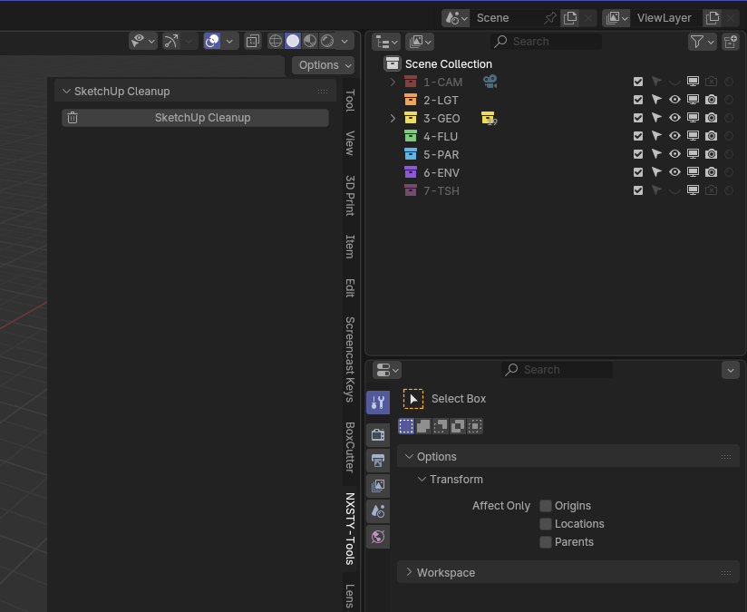

# 🧹 SketchUp Cleanup for Blender

A simple yet powerful Blender addon designed to instantly clean up messy 3D models imported from SketchUp.

---

## 🌟 The Problem

When you import models from SketchUp (usually as `.dae` or `.skp` files), they often come with a lot of extra, unnecessary data that can make your Blender scene cluttered and difficult to work with. This includes:

-   **Complex Parent Hierarchies:** Objects are often nested under numerous "Empty" objects, creating a confusing Outliner.
-   **Useless Empties:** The importer creates a large number of Empty objects that serve as containers but have no geometric data.
-   **Scattered Objects:** Your imported model parts are spread across the main scene collection.
-   **Incorrect Pivot Points:** Object origins are often not centered on the geometry, making them difficult to rotate or scale.

## ✨ The Solution

**SketchUp Cleanup** automates the entire cleaning process with a **single click**.

### Features:
-   ✂️ **Clear Parents:** Flattens the object hierarchy by clearing all parent-child relationships while keeping all transformations intact.
-   🗑️ **Delete Empties:** Selects and deletes all Empty objects in the scene, which are commonly created during SketchUp imports.
-   📍 **Center Pivots:** Resets the origin point for every object to its geometric center, making them easier to manipulate.
-   🗂️ **Organize Scene:** Moves all the cleaned objects into a new, neatly organized collection named `CleanUp`.

---

## 🚀 Installation

1.  Go to the [Releases](https://github.com/NXSXTYNATE/sketchup-cleanup.blender/releases) page.
2.  Download the latest `sketchup_cleanup.zip` file.
3.  Open Blender and go to `Edit` > `Preferences`.
4.  Navigate to the `Add-ons` tab.
5.  Click the `Install...` button and select the downloaded `.zip` file.
6.  Enable the addon by checking the box next to "Object: SketchUp Cleanup".

---

## 💡 How to Use

Using the addon is as simple as clicking a button!

1.  **Import your SketchUp model** into Blender.
2.  In the 3D Viewport, press the `N` key to open the sidebar.
3.  Look for a tab named **`NXSTY-Tools`**.
4.  Click the **`SketchUp Cleanup`** button.

  <!-- A placeholder for a future screenshot -->

Your scene is now clean and organized! All objects will be in the `CleanUp` collection, ready for you to work with.

---

## 👤 Author

-   **NXSXTYNATE**

Enjoy a cleaner Blender workflow!
